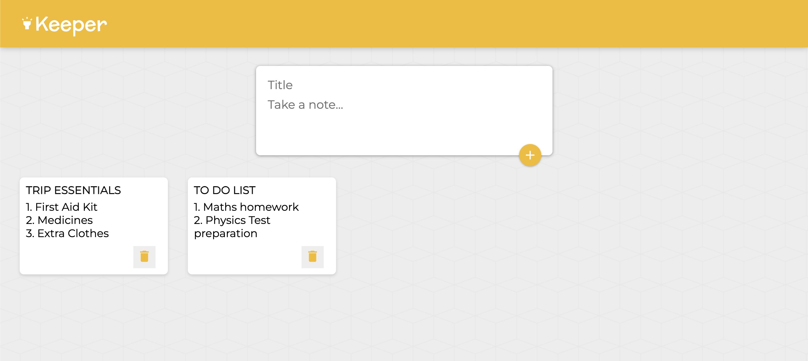

<h1 align="center">Note Keeper</h1>

<p align="center">
  A responsive note-taking application built with React and Vite.
</p>

<p align="center">
  <a href="https://vaish9825.github.io/note_keeper/"><strong>➥ Live Demo</strong></a>
</p>

<p align="center">
  
  
  
</p>

<p align="center">
  
</p>

## 🚀 Overview

**Note Keeper** is a clean and efficient Single Page Application designed for capturing thoughts instantly. It features a dynamic interface where users can add titled notes and delete them once completed, all without refreshing the page.

## ✨ Key Features

- **📝 Dynamic Input Area:** The "Take a note..." form expands only when you click on it , keeping the interface minimal.
- **⚡ Instant Updates:** Notes appear instantly upon clicking "Add" using React state management.
- **📱 Responsive Layout:** Notes are arranged in a fluid grid that adapts to different screen sizes.
- **🗑️ CRUD Capabilities:** Easily create new notes and delete completed ones.
- **🚀 Vite Powered:** Built with Vite for ultra-fast development and optimized production builds.

## 💻 Getting Started

Follow these instructions to set up the project locally on your machine.

### Prerequisites

Before you begin, ensure you have the following installed:
* **Node.js** (v16.0.0 or higher recommended)
* **npm** (usually comes with Node.js)

### Installation

1. **Clone the repository:**
   ```bash
   git clone [https://github.com/vaish9825/note_keeper.git](https://github.com/vaish9825/note_keeper.git)

2.  **Navigate to the project directory:**
   ```bash
   cd note_keeper

